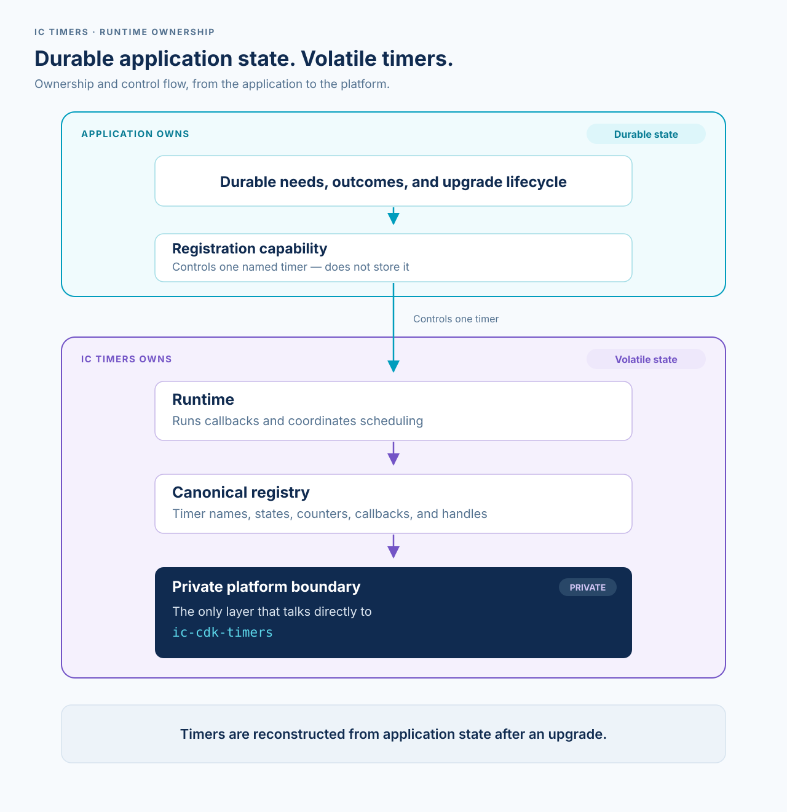
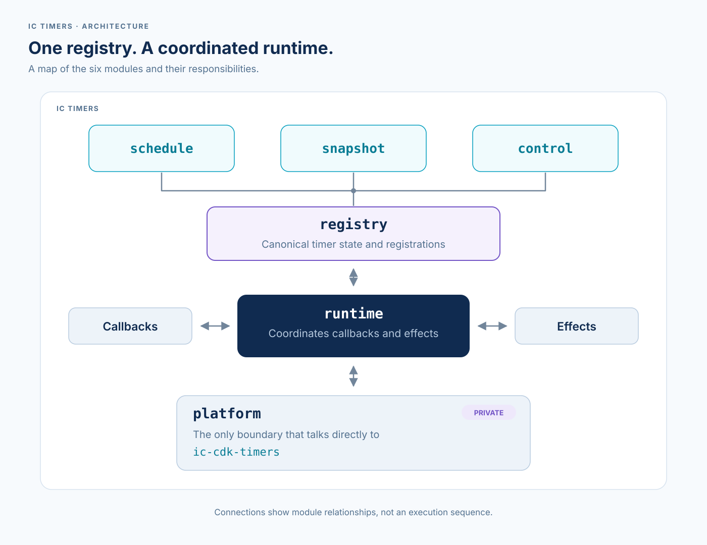

# Architecture

This document is a technical reference for developers working on or
integrating IC Timers. For a general introduction, start with the
[project README](../README.md).

## Overview

The application owns the lasting record of what work needs to happen. IC
Timers owns the temporary scheduling state used while the canister is running.
After an upgrade, the application uses its lasting state to rebuild the timers
it still needs.

A registration capability lets one owner control one named timer. The runtime
coordinates callbacks and scheduling, while one shared registry holds timer
names, states, counters, callbacks, and provider handles. Only the private
platform boundary talks directly to `ic-cdk-timers`.

The sections below describe these boundaries in implementation-level detail.

## Current runtime

The crate root is the only public facade. It re-exports runtime operations and
provider-neutral values directly; every implementation and value-grouping
module is private. In particular, neither `platform`, `registry`, `schedule`,
nor `snapshot` is a consumer import path.

The module hierarchy keeps six responsibilities separate:

1. `schedule` owns validated cadence, requested schedules, post-run
   directives, and checked nanosecond/deadline conversion. Explicit requests
   and ordinary directives resolve to one private `ResolvedSchedule` carrying
   deadline, requested delay and mode; Stop resolves to no successor. Pending
   commands retain that value directly, and completion does not derive control
   metadata from a directive snapshot.
2. `snapshot` owns inert public identity and observation values. Its private
   `identity`, `model`, and `metrics` children separate validation, closed
   state/outcome types, and saturating measurements. Only the registry builds
   the top-level timer and atomic inventory snapshots and initializes their
   observation aggregates. Platform reads construct inert `MemoryPageExtent`
   values directly. Those aggregates and extents expose no public construction
   or control path.
   Outcome observations project their latest classification and work count from
   one stored terminal event. Success, failure and unacknowledged timestamps and
   the expected-failure streak remain independent history.
3. `control` is the private ordinary generation/registration state machine. It
   owns checked callback generations, immediate schedule, reconciliation and
   stopping transitions. One counter owns ordinary allocation history and
   the active callback generation; state variants do not store another copy.
   Its inactive state owns its reason, its running
   state owns its pending command, and scheduled state carries neither. The
   registry owns exact running-work authorization and command arbitration.
   Completion arms its selected successor through the shared checked arming
   operation or stops with its selected reason, in the same atomic transition.
   Checked arming returns canonical `TimerControlFailure`
   values directly, without a private error conversion.
   Ordinary directive resolution also returns `TimerControlFailure` directly;
   explicit scheduling requests retain `ScheduleError` at their input boundary.
   The schedule owner classifies invalid successor proposals, while the registry
   owns terminal state and completion accounting.
   Cancellation in the registry stops scheduled state without allocating a
   generation and queues a command for running work. Stopping with a reason
   discards the running command through state replacement.
   The registry builds provider effects and retains cancellation policy without a
   separate cancellation or completion action. Scheduling requests return only
   an optional initial or replacement arm kind; generation and deadline remain
   in control state. Scheduling and completion share one checked arming operation.
   Within the same atomic transition, the registry builds each successful arm
   from its selected deadline and the allocated generation without a second
   registration-consistency recovery path.
4. `registry` is the provider-call-free fixed-capacity canonical owner for
   structured identities, callback closures, claim generations,
   policy-specific state, the sole pending ordinary-command machine, nested
   arbitration, deterministic snapshots, and provider-neutral effects. It also
   owns every bound provider handle; only `runtime` invokes `platform` to
   create or clear those handles. Each entry has one policy-specific payload
   containing its control and correctly typed callback. An ordinary payload
   without cadence is Once; one with cadence is AfterCompletion. Public policy
   observations are derived from that payload rather than stored separately.
   Both policy state machines own their inactive reasons; active states carry
   no inactive reason, and snapshots project the reason from the state itself.
   Watchdog awaiting-work state owns its pending command through both dispatch
   and execution. Work acceptance preserves it; leaving that state discards it,
   including when the scheduler retires an unacknowledged attempt.
   Watchdog control retains one generation counter. Each dispatch gives its
   successor and work the same fresh generation, distinguished by role. Scheduling
   requests while work is dispatched or running cannot replace that pair: exact
   scheduling waits for normal completion, and ensures coalesce or become pending
   commands. Completion either retains the successor, replaces it after expiring
   the work attempt, or stops. A later recovery scheduler also expires the old
   attempt before advancing the generation. No state repeats allocation history.
   Authorization checks generation together with state, claim and role; awaiting
   snapshots expose that generation once and project `attempt_status` directly,
   without a separate attempt wrapper. Tokens and owned handles keep their
   independent delivery stamps for stale-callback rejection and separate slots.
   This 0.11.0 observation change and its pending qualification are recorded in the
   [generation ownership note](changelog/0.11.0.md).
   Ordinary completion computes its removal-on-stop decision once from pending
   unregister and declaration lifetime; every terminal exit uses it. A successful
   arm retains its declaration. Cancellation derives immediate removal once
   from final inactive state and lifetime for both ordinary and Watchdog
   declarations; running work retains pending authority.
   Watchdog completion decides removal once after selecting its final state:
   inactive declarations follow their lifetime and pending unregister command,
   while retained or replaced successors keep their declaration.
   Watchdog cancellation selects the handles to clear in one state match. An
   immediate stop uses that selection for state replacement, cancellation
   accounting and provider cleanup; running work keeps its pending command, and
   inactive cancellation preserves the existing reason. No generation is allocated.
   Ordinary schedule requests share counter, request-metadata and coalescing
   updates. Recurring ensure submits an existing scheduled deadline unchanged;
   it calculates a cadence deadline only for inactive or running declarations.
   Owned provider roles follow entry policy and handle slot rather than a copied
   field. Installation and consumption reject policy/role mismatches before using
   a slot; detached handles retain complete tokens for restoration and cleanup.
5. `platform` is the private direct boundary to `ic-cdk-timers` and required
   IC system facts. Its handle is linear and it owns no recurrence policy.
   Page reads return the same inert extent representation used in snapshots,
   without a parallel platform value or a registry conversion.
6. `runtime` owns the one canister-local registry static, erases consumer
   callbacks for registry storage, exposes registration claims, applies
   provider effects, and drives live `Once`/`AfterCompletion` dispatch and the
   two-role watchdog protocol. Its three policy-specific delegated work
   contexts wrap one private mechanism and are valid only for the exact
   running callback token.
   Each private token contains its registration claim, callback generation and
   role. Context control and callback cleanup borrow that claim instead of
   reconstructing it. Owned delivery tokens remain cloneable; registration
   capabilities remain non-clone. Borrowed claims still require the operation's
   exact running-work or provider-ownership validation.
   Claim-originated effect failures retire the declaration instead of leaving
   registry state scheduled without a provider handle. Lifecycle verification
   checks the exact claim and immutable declaration metadata directly rather
   than reconstructing authority from a snapshot. Synchronous operations that
   detach handles restore all of them before returning an unexpected registry
   error, retiring the exact claim if restoration cannot recover ownership.
   One detached-claim finalizer owns registry-error restoration and successful
   transition application, including retirement after unexpected provider failure.
   Callback finalization remains separate to preserve Watchdog rollback rules.
   One consuming binding operation installs a raw provider handle or clears it
   on rejection after releasing the registry borrow. Arm and restoration callers
   receive only the typed error; Watchdog dispatch separately clears its installed
   successor if later work binding fails. Work binding and dispatch confirmation
   share a cleanup exit, with confirmation strictly after successful installation.
   Effect application consumes one complete registry effect; its shape is
   validated before cleanup or platform calls. Its matched branches perform
   binding directly without passing the effect through another variant match or
   duplicating token and delay arguments beside it. One initial/replacement
   arm kind flows from ordinary control through provider binding, and the
   non-empty set of callbacks to clear is also a closed value rather than
   independent booleans. The entry-local exact-claim predicate is shared by
   callback acceptance, measurements, provider installation, and handle
   consumption, so identity reuse cannot transfer handle authority to a stale
   callback.
   Work acceptance checks the exact claim, policy, work role, generation and
   eligible state, then transitions to running state and returns that entry's
   correctly typed callback. Dispatch releases the registry borrow before
   invoking consumer work; there is no separate callback lookup or second borrow.
   Duplicate or stale acceptance returns no callback and keeps its existing stale
   accounting. Installation and effect confirmation retain their own required
   role, generation and state checks.
   Delegated control and both work-completion paths share one entry-local
   running-work predicate for the exact claim, work role, generation and running
   state. Completion checks it before any mutation; provider binding and completed
   measurements retain their distinct validation boundaries.

Absolute deadlines remain authoritative in policy control state and its snapshot
projection. Provider arm effects carry only the resolved delay, callback authority
and arm kind; they do not store another deadline representation.

The registry and runtime transition functions remain cohesive even where they
are long: each audited function owns one atomic transition or one provider
binding path. Their tests live in directory-local `tests.rs` files so test
volume does not obscure production flow.

The copied Canic code was adapted into generic library types; Canic-specific
domain work, storage, and metrics were intentionally not copied.

## Canonical runtime

One canister-local runtime owns the bounded registry and its structured
identity (`owner`, `subsystem`, `name`). Framework and application schedulers
must contribute to that same live registry rather than building private
inventories. All three policies, lifecycle reconstruction, measurements, and
the real-canister watchdog evidence matrix are implemented.

The runtime provides:

- one-shot, after-completion interval, and pre-armed watchdog policies;
- serial execution with overdue work coalesced into one pending run;
- cancellation requested safely by the running callback;
- synchronous lifecycle restoration followed by deferred application work;
- registration-lifetime counters, last outcomes, deadlines, instruction consumption,
  and bounded memory-page extent/growth observations;
- exact-claim observation of armed provider wake-up ownership without a
  snapshot-derived control path;
- bounded identity components and allocation-conscious hot paths;
- one atomic inventory snapshot carrying the runtime epoch even when empty;
  and
- portable snapshot DTOs so Canic, IcyDB, and standalone canisters can
  expose the same operator view.

Metrics are collected once at the registry boundary. Consumers may adapt
the atomic inventory to their own status endpoint or metrics encoder without
wrapping every callback independently.

The canonical snapshot is designed as a semantic superset of Canic's current
timer status, scheduling counters, and instruction metrics. In particular,
callback starts and completions remain separate because traps and instruction
exhaustion can prevent post-run measurement, and consecutive expected failures
remain cheap functional state because recovery decisions consume them. See the
[observability and Canic parity contract](design/observability.md).

## Frozen 0.3 contract

Patch 1 freezes the registry, callback, ownership, state, counter, lifecycle,
provider, MSRV, and measurement decisions before runtime mutation. The
canonical registry holds at most 64 declarations. Ordinary work may be async;
watchdog work is synchronous so its separate work message cannot cross an
`await`. Provider handles are private, linear capabilities owned only by the
registry. See the [Patch 1 runtime contract](design/0.3-patch-1-contract.md).

The live snapshot omits elapsed IC time: message time cannot truthfully measure
synchronous callback duration. It instead distinguishes scheduler and work
instructions, plus latest start/end and maximum-growth Wasm/stable memory-page
observations. Page extent is not exact allocator liveness. A dispatched
watchdog attempt without a committed completion is *unacknowledged*, not
definitely trapped, and has no fabricated measurement.

## Implementation sequence

Keep the runtime work in independently testable layers:

1. **Complete:** freeze downstream invariants, API/state decisions, provider
   behavior, Rust 1.88 feasibility, and measurement subjects.
2. **Complete:** add the coherent value model and pure bounded policy-specific
   registry.
3. **Complete:** bind linear platform handles and implement live `Once` and
   `AfterCompletion` policies.
4. **Complete:** implement the one-shot two-message `Watchdog` protocol and
   prove its initial explicit-trap commit boundary in PocketIC.
5. **Complete:** add lifecycle reconstruction, live observations, measurement,
   and the IcyDB-shaped fixture.
6. **Complete:** close the PocketIC recovery/isolation matrix and report Wasm,
   instruction, cycle, MSRV, and complexity results.

Each layer lands with its owner-local correctness tests. Cross-owner
real-canister evidence closes the final patch rather than substituting for
pure transition coverage.

Lifecycle reconciliation always installs retained declarations so a
caller-owned `Option<Registration>` cannot outlive a remove-on-stop canonical
entry. Transient `RemoveWhenStopped` timers use direct registration and are
recreated explicitly by their owner if later desired; cancellation removes a
transient declaration even before its first schedule. One private lifecycle
seam installs and verifies the exact retained claim for all three policies.

## Safety boundary

An after-completion interval is not a watchdog: if its callback traps or runs
out of instructions, code after the callback cannot arm a successor. A
watchdog policy commits the successor before invoking fallible work while
preventing concurrent logical execution. PocketIC 15 proves that behavior for
trap, 40-billion-instruction exhaustion, upgrade reconstruction,
external-ingress rejection, independent timers, insufficient cycles followed
by top-up, stop/resume, overdue coalescing, and cancellation in the
scheduler/work gap. These proofs apply to synchronous `Watchdog`, not
after-completion recurrence.

After normal progress, a Watchdog may replace that exact cadence successor with
a deadline of now. The replacement remains a scheduler callback in a later
replicated message; that scheduler again pre-arms cadence safety before it
queues work. Initial immediate reconciliation and running-work requests use the
same declaration, claim, generation, pending-command, and provider-handle path.
See the [immediate continuation design](design/immediate-watchdog-continuation.md).

Since 0.8.0, exact Watchdog reconciliation can also move a sleeping deadline
earlier or later. Dispatched or running work retains the committed cadence
recovery successor until normal completion applies the pending schedule or
`WatchdogDecision::ScheduleAt`. Snapshots carry a registration identity so
consumers can detect counter replacement within one runtime epoch. See the
[continuity and deadline contract](design/0.8-registration-continuity-and-deadlines.md).

## Consumer integration

The following records describe the supplied exact-0.5.0 adoption evidence,
not a current downstream dependency audit or qualification of 0.8.0:

- Canic adopted exact `ic-timers` 0.5.0 for framework and application timers and
  exposes schema-3 timer, instruction, and memory observations. Canisters
  initialize the shared registry independently of declaring jobs: Fleet
  Coordinator initializes an empty registry, while genuine owners reserve
  their fixed declarations before application hooks.
- IcyDB adopted exact `ic-timers` 0.5.0 and the watchdog policy for replicated
  recovery driving with claim-scoped armed-wakeup observation.
- A canister using both should see one inventory. Ownership labels distinguish
  scheduling clients; they do not create separate timer runtimes.

The combined downstream gate must prove one resolved `ic-timers` package ID,
both owners in one inventory, synchronous lifecycle reconstruction, IcyDB
Watchdog recovery, continued Canic timer progress, and no remaining direct
`ic-cdk-timers` calls across the complete canister. The lifecycle-composition
blocker in the original 0.5.0 records was resolved within the frozen 0.8.0
subject described in the [Toko Miner receipt](adoption/toko-miner.md).
That receipt does not qualify later dependency combinations or deployments.
The provider's 250 outstanding-dispatch limit is canister-wide; the registry's
128-handle maximum bounds only handles owned by this crate. Canic must also
retain the validated hard cut that makes its application timer facade return
typed capacity and identity errors.

The exact implemented hard-cut mapping, including authoritative deadline
reconciliation, policy choices, and the intentional absence of global
suspension, is maintained in the [Canic adapter contract](adoption/canic.md).

Canic may keep one bounded collection whose only values are opaque registration
claims. That custody makes Canic-owned application timers enumerable for its
authority-snapshot fence without duplicating registry state. Scheduling,
deadlines, generations, counters, pending commands, provider handles, and
reconciliation authority remain exclusively in `ic-timers`.

Consumer callbacks may issue nested control through `OnceContext`,
`AfterCompletionContext`, or `WatchdogContext`. Each type exposes only the
operations legal for its policy, while the shared private delegation is
checked against the exact running generation and work role. A stored context
expires at callback completion and cannot become another entry in a consumer
custody collection.

IcyDB's exact dependency, removed parallel timer state, and downstream
real-canister evidence are recorded in the
[IcyDB adoption record](adoption/icydb.md). The
[Canic adapter contract](adoption/canic.md) records its exact-0.5.0/schema-3
adoption. Both original subjects independently resolve 0.5.0; the later combined
0.8.0 subject is recorded separately in the [Toko record](adoption/toko-miner.md).
Qualification of a new combined subject requires evidence against its actual
dependency graph and Wasm artifact.
