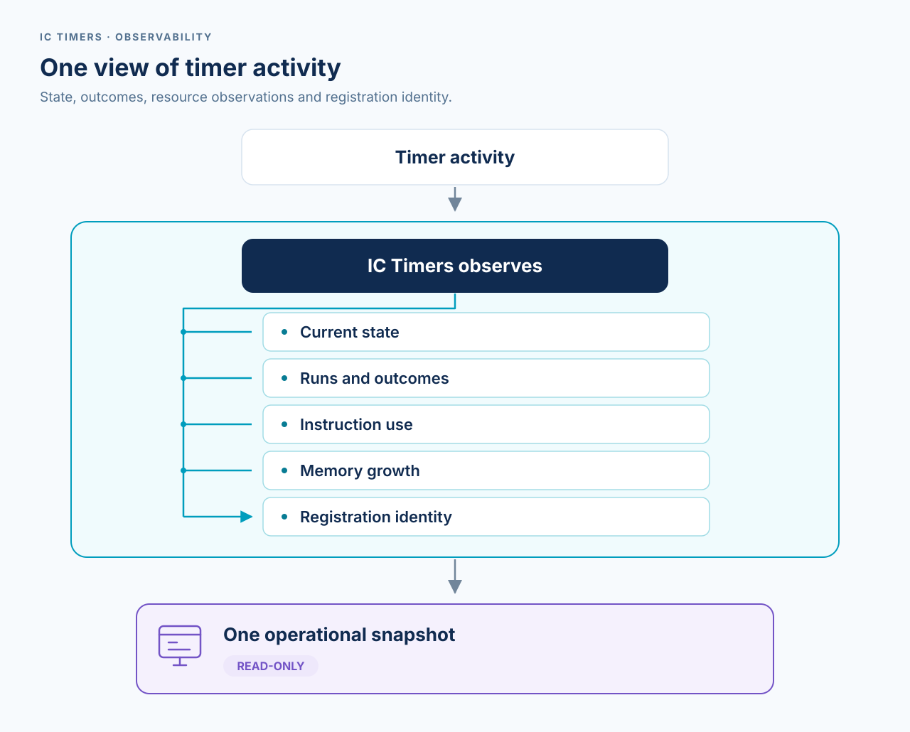

# Observability and Canic parity contract

Status: canonical observations live; historical adoption evidence linked below.

## In plain English

Observability means being able to see what the timers are doing without using
those observations to control them. IC Timers provides one read-only snapshot
of each timer's identity, current state, recent outcomes, counters, instruction
use, and observed memory growth.

The snapshot helps operators answer questions such as: Is this timer waiting or
running? Did its last completed task succeed? How often has it run? Has its
observed resource use grown?

These measurements have limits. They do not prove that a task was delivered,
measure the complete Internet Computer message, or identify the exact amount
of memory still in use. A task that crashes or runs out of instructions cannot
record a completed measurement after it stops.



## Purpose

The canonical `ic-timers` snapshot replaces duplicated timer instrumentation
and covers the recorded Canic parity baseline below.

Ordinary and watchdog state, scheduler dispatch, work, stale,
unacknowledged, instruction, and memory-page observations are live. Normally
completed accepted scheduler and work callbacks record the `ic-timers`
execution interval from immediately before acceptance through completion
processing and any successor binding. They do not isolate application code.
The provider dispatch prefix, provider return/reply tail, page reads, and
post-interval measurement-summary update are outside the instruction delta.
It is therefore not a complete IC-message measurement and must not be used
alone as proof against the IC message instruction limit. Trapped and exhausted
work record no sample. Real-adapter parity and combined qualification are
downstream evidence obligations, described in the
[consumer integration contract](../architecture.md#consumer-integration).

This contract describes provider-neutral runtime data. `ic-timers` owns the
identity, counters, measurements, and snapshot semantics. Canic, IcyDB, and
standalone canisters adapt that snapshot into their own Candid DTOs, status
responses, or metric rows. This crate must not depend on Canic's Candid types,
unified metrics DTOs, or presentation conventions.

## Implemented 0.3 decisions

The frozen [0.3 Patch 1 runtime contract](0.3-patch-1-contract.md) replaced two
candidate 0.2 terms when the values became live registry observations:

- a committed watchdog dispatch without committed completion is
  `unacknowledged`, not definitely interrupted or trapped; and
- elapsed callback duration is omitted because IC message time cannot measure
  synchronous work duration truthfully.

The 0.3 runtime also splits scheduler wake-up arms from watchdog work dispatch
arms, and scheduler instruction aggregates from accepted work-envelope
instruction aggregates. Those decisions do not weaken the Canic
semantic-superset gate.

## Canonical snapshot

Every declared timer has one registry-constructed canonical snapshot with the
following groups.

| Group | Required content |
| --- | --- |
| Identity | Bounded `owner`, `subsystem`, and `name` labels forming one ordered `TimerIdentity`. |
| Policy | Configured scheduling policy and cadence, plus the latest post-run directive when it differs from the configured policy. |
| Scheduling | Latest requested delay, latest actually armed delay, scheduling mode, next absolute deadline, and any watchdog successor. |
| State | Closed policy-specific state, registration projection, process condition, current generation, and watchdog attempt status. |
| Outcome | Latest classified outcome, work count, last success and failure timestamps, and consecutive expected failures. |
| Counters | Requests, wake-up arms, work dispatch arms, scheduler starts, work starts/completions, classified outcomes, cancellations, stale callbacks, coalescing, and unacknowledged attempts. |
| Performance | Separate sample count, total, latest, and maximum instructions for normally completed accepted scheduler/work intervals; per role, bounded latest start/end Wasm/stable page extents and maximum per-callback growth. |
| Scope | Runtime epoch plus registration identity defining the counter and aggregate lifetime, including replacement within one epoch. |

Configured recurrence and callback directives are related but distinct. The
configured policy should distinguish one-shot, after-completion, and watchdog
behavior. The latest directive should retain deadline, retry, immediate
continuation, recurrence, and stop decisions without pretending that a retry
temporarily changes the timer's configured policy.

An ordinary exact reconciliation winning at completion replaces the callback
proposal before validation. `latest_directive` then projects the effective
absolute `ScheduleAt` directive. A relative exact
request still retains its once-resolved deadline, scheduling mode and requested
delay through the selected registry command. Cancellation and explicit invariant
failure project `Stop`. Overridden proposals are not separately retained.

For a Watchdog whose cadence successor has been moved to now,
`scheduling_mode` is `Continuation`, its authoritative next deadline is the
immediate deadline, and the latest requested/armed delays are zero. The
replacement increments `wakeups_armed`; repeated, already-earlier, dispatched,
or running immediate demand increments `coalesced` without inventing another
handle. Once that scheduler runs and pre-arms safety again, the current mode
and armed delay return to the configured Watchdog cadence.

All identities and enum values must have deterministic ordering. Labels must
be bounded before they enter registry storage or metric labels. The snapshot
must remain portable, but portability does not require a dependency on a
consumer's serialization model.

## Registration continuity

`TimerSnapshot::registration_id()` combines the existing registry claim sequence
with the runtime epoch. Cancellation, scheduling and completed or interrupted
work retain it; unregister/re-register changes it and resets measurements. An
upgrade changes the epoch. Callback `generation()` is not a continuity key.

Consumers may project the inert epoch/sequence fields, but cannot use them as
control authority. For interval arithmetic, require the same canister and
registration identity, advancing source times, compatible windows, nondecreasing
values, and neither endpoint at `u64::MAX`. Saturation makes an exact delta
unavailable. Matching identities alone do not prove freshness, complete-message
accounting, transfer coverage or cycle cost. Reinstalls and restored/forked
histories are separate observation histories.

The [0.8 contract](0.8-registration-continuity-and-deadlines.md) defines the full
continuity, saturation, deadline and downstream-adoption boundaries.

## Atomic inventory scope

`timer_inventory()` returns one `TimerInventorySnapshot` containing the
runtime epoch and the complete bounded timer vector in deterministic identity
order. The epoch is therefore observable even when the initialized registry is
empty; consumers do not derive the counter-reset boundary from the first timer
or issue separate epoch and inventory reads. `timer_snapshot()` remains the
focused lookup for one known identity.

The former bare-vector `timer_snapshots()` function is removed in the 0.6 hard
cut. Keeping both would preserve two public inventory shapes for the same
canonical observation without adding authority or information.

## Counter semantics

The counter contract distinguishes requests made to the wrapper from effects
performed against `ic-cdk-timers` and from callbacks that actually execute.

| Counter | Required meaning |
| --- | --- |
| `schedule_requests` | Validated schedule or reconciliation requests, including requests later coalesced or satisfied without another platform arm. |
| `wakeups_armed` | Actual ordinary-work or watchdog-scheduler one-shots whose handle ownership committed. |
| `work_dispatched` | Immediate watchdog-work one-shots committed by scheduler messages. |
| `scheduler_started` | Non-stale watchdog scheduler callbacks accepted by generation arbitration. |
| `work_started` | Non-stale consumer-work callbacks that enter logical execution. |
| `work_completed` | Consumer work that returns and commits completion accounting. |
| `succeeded` | Completed callbacks classified as successful work. |
| `no_work` | Completed callbacks that validly find no work to perform. |
| `retryable_failure` | Completed callbacks with an expected failure that permits retry policy. |
| `invariant_failure` | Completed callbacks reporting an unexpected invariant or terminal failure. |
| `cancelled` | Logical registrations or runs ended because cancellation wins arbitration; this is not merely the number of cancel API calls. |
| `stale_wakeups` | Ordinary or scheduler callbacks rejected because their generation no longer owns execution. |
| `stale_work` | Watchdog work callbacks rejected because their generation no longer owns execution. |
| `coalesced` | Scheduling demand merged into existing scheduled or pending work rather than producing another logical run. |
| `unacknowledged` | An older committed watchdog dispatch retired by its successor without a committed completion. |

On the 0.10 line, explicit invariant failure takes precedence over pending
cancellation for both ordinary and Watchdog stop classification. A retained
declaration reports `InvariantFailure` and `Failed`; a losing cancellation does
not increment `cancelled`. Sticky unregister and transient removal still apply.
The new Watchdog combination requires maintainer execution of its native fixtures
before it is treated as validated behavior.

Every completed callback has exactly one classified completion outcome. Before
counter saturation:

```text
work_completed = succeeded + no_work + retryable_failure + invariant_failure
```

The classified counters are authoritative. `work_completed()` projects their
saturating sum instead of storing a second total. This preserves the completed
count at saturation too: each committed completion increments exactly one class,
and the projected total remains `u64::MAX` once their sum reaches that limit.

`work_started` and `work_completed` must never be collapsed into one execution
count.
Canic currently records a callback start before it can record post-run
instructions. A trap or instruction exhaustion can prevent completion
instrumentation, so preserving both counters is necessary to expose incomplete
work rather than silently treating it as a zero-cost completion.

## Outcomes and functional state

`consecutive_expected_failures` is runtime state, not a presentation-only
metric. It must be stored with the timer entry and available without scanning
or rebuilding the complete snapshot. Registry lookup by `TimerIdentity` should
make it cheap enough for renewal and cycle-top-up decisions.

Retryable expected failures increment the streak. Success, valid no-work and
invariant-failure outcomes reset it; an interrupted attempt preserves it.
Maintained transition tests cover these rules.

`work_count` is separate from callback starts and completions. One callback may
find no work, perform one unit, or perform a bounded batch, so an adapter must
not infer work count from callback counters.

## Measurements and scope

Instruction aggregates contain sample count, total, latest, and maximum values
for scheduler and work roles. Each accepted interval begins immediately before
callback acceptance and ends after completion processing plus any successor
binding, so it includes `ic-timers` arbitration and provider binding as well as
consumer work. It is not an application-only measurement. The start page read
precedes the instruction interval; the end page read and bounded summary write
follow it. Provider executor work before entering `ic-timers` and after the
runtime callback returns also remains outside it. The corresponding memory
summaries contain a saturating sample count, the latest start/end Wasm and
stable extents in 64 KiB pages, and maximum non-negative observed start-to-end
growth for each memory.
They never total absolute page counts. Ordinary callbacks may await, so their
sample interval can include interleaved canister activity and is not exclusive
allocation attribution; Watchdog work and scheduler paths are synchronous.
For each role, memory and instruction sample counts advance together on the
same normal-completion record.

Both measurement kinds update only when the measured callback path returns
with a valid end measurement. A missing work completion remains visible through
committed dispatch and later `unacknowledged` observation; the runtime does not
synthesize zero instructions or a memory sample for trapped or exhausted work.
If a terminal `RemoveWhenStopped` callback removes its declaration during
normal completion, the post-transition measurement has no remaining timer on
which to commit and is discarded. This is intentionally different from
fabricating a zero sample: the transient timer itself is absent from the final
inventory. A consumer that requires a durable terminal audit receipt must own
that receipt outside the volatile timer registry; `ic-timers` does not retain
tombstones or create a second authority for removed declarations.

Elapsed IC time is absent because message time is not a truthful synchronous
duration. Page reads bracket the instruction-delta interval from outside, so
memory observation does not change which instructions that aggregate covers.
The focused [0.5 sampling-overhead probe](../audits/0.5-memory-sampling-overhead-2026-08-15.md)
keeps those costs separate: PocketIC 15.0.0 reported 200 call-context
instructions for both an empty counter bracket and the matching start/end
page-read bracket, an observed delta of zero for the four reads. This is a
regression subject, not a future IC metering guarantee, and it does not claim
to isolate the bounded summary update performed after the interval.

PocketIC 15's public test surface does not expose the complete instruction
total for an individual timer-generated update message. The focused
[0.6 calibration probe](../audits/0.6-message-instruction-calibration-2026-08-15.md)
therefore reports the available scheduler/work intervals for minimal and
bounded representative Watchdog work, while marking the full-message total
and residual difference unavailable. Cycle-balance deltas are not converted
to instructions. Real message-level trap and exhaustion evidence remains
required for hard instruction-limit claims.

Within one runtime epoch, Wasm and stable page counts are monotonic
extent/high-water observations. They are not exact live bytes: allocator
liveness within the final page is invisible at this boundary. Consumers
needing a byte-level bound must derive it from their allocator or storage owner
rather than asking `ic-timers` to fabricate one.

The snapshot carries a runtime epoch and a registration identity. Counters and
aggregates belong to that registration lifetime and are never persisted by the
library. Both upgrade and unregister/re-register resets are explicit to adapters;
consumer-owned durable demand used for reconstruction is a separate concern.

All arithmetic must define overflow behavior. Hot-path counters and aggregates
must not trap because an operator metric reached its numeric limit.

## Claim-scoped wake-up observation

Each policy-specific registration capability exposes `has_armed_wakeup()`.
It returns whether that exact current claim owns the registry's future
provider wake-up handle. It does not derive liveness from snapshot fields. For
a watchdog, the separately queued immediate work handle does not count; the
already committed cadence successor does. For ordinary work running before a
successor is installed, the result is false.

This helper is an inert volatile observation, not a check-then-arm protocol,
durable authority, or a guarantee that provider delivery will occur.
Consumers whose durable authority requires future work must call the
idempotent ensure operation unconditionally. An expired remove-on-stop claim
returns `RegistrationExpired` rather than observing a later registration with
the same identity.

## Implemented value decisions

The runtime makes the following choices. Downstream adapters may continue to
provide feedback as the pre-1.0 API evolves:

- Each identity component is non-empty, limited to 64 UTF-8 bytes, and rejects
  surrounding whitespace and control characters. Exact label text is retained
  and ordered lexicographically by owner, subsystem, then name.
- Portable process conditions preserve Canic's disabled, idle, active,
  retrying, and failed states. Completion outcomes preserve success, no-work,
  retryable-failure, and invariant-failure classes. `Unacknowledged` is a
  separate non-completion event with unknown, rather than synthetic zero, work
  and performance measurements.
- Success, valid no-work, and invariant failure reset
  `consecutive_expected_failures`; a retryable failure increments it and an
  interruption preserves it. This matches current Canic recovery-state
  transitions.
- An unacknowledged attempt is counted in the epoch and scheduler message that
  retires its committed dispatch. It has no arithmetic invariant with
  `work_started`, because a trapping work-message start mutation rolls back.
- Counts, work, instructions, page extents, and nanosecond values use `u64`.
  Hot-path counters, streaks, sample counts, and instruction totals saturate;
  latest and maximum measurements continue to update after count or total
  saturation. Absolute memory extents have no total.
- The crate exposes provider-neutral Rust values and stable enum labels but no
  Candid or Serde contract. Consumers own serialization adapters. Public API
  evolution follows crate SemVer rather than a consumer's wire format.

## Canic parity baseline

The following tables describe the recorded exact-0.5.0 Canic operator baseline
without parallel timer instrumentation. They do not qualify later deployments.

| Recorded Canic surface | Required projection from `ic-timers` |
| --- | --- |
| Timer executions and latest delay in `crates/canic-core/src/ops/runtime/metrics/timer.rs` | Started count, configured cadence, latest requested and armed delays, and next deadline. |
| Completed count and total instructions in `crates/canic-core/src/ops/runtime/perf.rs` | Completed count and total, latest, and maximum instructions. |
| Detailed state in `crates/canic-core/src/dto/runtime.rs` | One canonical snapshot containing semantically equivalent identity, policy, state, outcome, and timing fields. |
| Former test-only global `TimerScheduled` count | No public projection requirement; remove it rather than retain parallel instrumentation. Canonical requested and armed counters remain separately observable. |

The compatibility requirement is semantic rather than type-level. The
[exact-0.5.0 Canic adoption record](../adoption/canic.md) documents schema-3
runtime introspection derived from `ic-timers`, including bounded memory-page
observations.

The recorded field projection is:

| Canic field | Canonical source |
| --- | --- |
| schedules | `wakeups_armed` |
| executions | `work_started` |
| successes | saturating `succeeded + no_work` |
| expected failures | `retryable_failure` |
| invariant failures | `invariant_failure` |
| stale callbacks | saturating `stale_wakeups + stale_work` |
| latest delay | `latest_armed_delay_ns` converted to milliseconds |
| generation | `TimerSnapshot::generation()` as `Option<u64>` |
| completed instruction count | work-instruction sample count |
| total/latest/maximum instructions | matching work-instruction aggregate |

`schedule_requests` is intentionally not the legacy schedule count: it also
includes coalesced demand that did not commit a provider arm. The recorded
Canic adoption hard-cuts its unconditional `generation: u64` to `Option<u64>`
so inactive declarations do not fabricate generation zero.

The removed global `TimerScheduled` counter was a test-only implementation
detail, not a public Canic metric or status field. Keeping it would have
created misleading duplicate instrumentation. The per-timer `schedules` field
is the operator surface that retains the committed-arm meaning.

## Acceptance criteria

The accepted contract requires all of the following:

1. For every Canic timer, the `ic-timers` snapshot is a semantic superset of
   the existing timer status, timer counter, scheduling counter, and timer
   instruction metrics.
2. Focused Canic adapter tests demonstrate projection of the existing operator
   surfaces without separate timer instrumentation.
3. Unit tests fix the meanings and invariants of every counter, including
   request-versus-arm and start-versus-completion cases.
4. Outcome transition tests fix the increment and reset behavior of
   `consecutive_expected_failures`.
5. Snapshot ordering, label bounds, epoch reset semantics, numeric saturation,
   and measurement aggregation are explicit and tested.
6. `ic-timers` has no dependency on Canic-specific DTO, Candid, or metric-row
   types.

The local tests include Canic-shaped projection fixtures proving the fields
are available. Historical adapter and composition evidence belongs in the
[Canic adoption record](../adoption/canic.md),
[IcyDB adoption record](../adoption/icydb.md), and
[Toko Miner receipt](../adoption/toko-miner.md), each scoped to its recorded
subject. The [consumer integration contract](../architecture.md#consumer-integration)
defines the evidence required for a new combined subject. Historical receipts
do not qualify later dependency combinations or deployments.
